# CREATIVE PHASE 7: AGENTS AND OVERRIDES DESIGN DECISIONS

## 🎨🎨🎨 ENTERING CREATIVE PHASE: AGENTS AND OVERRIDES SYSTEM

### Component Overview
Phase 7 requires designing multiple interconnected components for employee/agent management and manager-employee relationship assignment. This system is critical for organizational hierarchy and affects payroll access control throughout the application.

---

## 🏗️ ARCHITECTURE DESIGN CREATIVE PHASE

### Requirements & Constraints
**Functional Requirements**:
- Complete CRUD operations for employee records
- Optional user account creation/linking during employee creation  
- Manager-employee relationship management with intuitive assignment interface
- Admin-initiated password reset functionality
- Role-based access control integration with existing auth system

**Technical Constraints**:
- Must integrate with existing database schema (employees, users, manager_employees tables)
- Follow established patterns from payroll and document management systems
- Maintain compatibility with existing PayrollRepository access control logic
- Support both desktop and mobile responsive design

**Business Constraints**:
- Admin-only access for employee management operations
- Manager relationship changes must not break existing payroll access
- User account creation must follow security best practices
- Password reset must include audit trail

### Architecture Options Analysis

#### Option 1: Monolithic Employee Management Component
**Description**: Single large component handling all employee operations
**Pros**: 
- Simple routing structure
- All employee data in one place
- Easier state management
**Cons**:
- Large component bundle size
- Difficult to maintain and test
- Poor code reusability
- Complex permission handling

#### Option 2: Modular Component Architecture (RECOMMENDED)
**Description**: Separate components for each major function (list, create, edit, relationships)
**Pros**:
- Better code organization and maintainability  
- Component reusability across different contexts
- Clear separation of concerns
- Easier testing and debugging
- Progressive loading for better performance
**Cons**:
- More complex routing
- Need for shared state management
- Slightly more initial setup

#### Option 3: Page-Based Architecture with Shared Components  
**Description**: Separate pages with shared form components and utilities
**Pros**:
- Clear URL structure for bookmarking
- Each page can be independently optimized
- Follows Next.js App Router patterns
- Good SEO for each page
**Cons**:
- Potential code duplication
- More complex navigation between related tasks

### Recommended Architecture: Hybrid Modular-Page Approach


**Implementation Guidelines**:
- Use separate pages for major workflows (list, create, edit, overrides)
- Create reusable form components for employee data entry
- Implement shared utilities for validation and API calls
- Use React Hook Form with Zod validation for consistent form handling
- Follow established patterns from existing payroll and document pages

---

## 🎨 UI/UX DESIGN CREATIVE PHASE

### Manager-Employee Assignment Interface Requirements
The most complex UX challenge is designing an intuitive interface for managers to assign employees to their oversight.

**User Needs Analysis**:
- **Managers need**: Clear view of who reports to them
- **Admins need**: Easy way to restructure reporting relationships  
- **System needs**: Prevent circular assignments and maintain data integrity
- **Users need**: Visual feedback on assignment changes

### Assignment Interface Design Options

#### Option 1: Traditional Dropdown Selection
**Description**: Dropdown lists for selecting manager-employee relationships
```
[Manager: John Smith ▼] manages [Employee: Jane Doe ▼] [Add Assignment]
```
**Pros**:
- Simple to implement
- Familiar user pattern
- Works well on mobile
- Clear action-result relationship
**Cons**:
- Tedious for bulk assignments
- No visual hierarchy representation
- Difficult to see current state at a glance

#### Option 2: Drag-and-Drop Card Interface (RECOMMENDED)
**Description**: Visual card-based interface with drag-and-drop assignment

```mermaid
graph LR
    ManagerCards["Manager Cards<br>📊 John Smith (5 employees)<br>📊 Mary Johnson (3 employees)"]
    AvailableEmployees["Available Employees<br>👤 Jane Doe<br>👤 Bob Wilson<br>👤 Alice Brown"]
    ManagerDetail["Manager Detail View<br>John Smith<br>├── Jane Doe<br>├── Bob Wilson<br>└── Current Team"]
    
    ManagerCards --> ManagerDetail
    AvailableEmployees -->|"Drag to Manager"| ManagerDetail
    ManagerDetail -->|"Drag to Available"| AvailableEmployees
```


**Pros**:
- Intuitive visual interaction
- Clear current state representation
- Efficient for bulk operations
- Modern, engaging user experience
- Easy to understand manager hierarchies
**Cons**:
- More complex to implement
- Requires drag-and-drop library
- May need mobile-specific adaptations

#### Option 3: Tree View with Checkboxes
**Description**: Hierarchical tree view with checkbox selection
**Pros**:
- Clear hierarchical visualization
- Good for complex organizational structures
- Familiar pattern from file managers
**Cons**:
- Can become cluttered with many employees
- Less intuitive for assignment operations
- Difficult to implement responsive design

### Recommended UI Design: Progressive Disclosure Card Interface

**Primary View - Manager Overview**:
```
🏢 Manager Overview                                     [+ Add New Employee]

📊 John Smith (Manager)           📊 Mary Johnson (Manager)
   └── 5 employees                   └── 3 employees  
   [View Details]                    [View Details]

📊 Unassigned Employees: 12
   [View Unassigned]
```

**Detail View - Manager Assignment Interface**:
```
← Back to Overview

👨‍💼 John Smith - Team Management

Current Team (5)                    Available Employees (12)
┌─────────────────────┐            ┌─────────────────────┐
│ 👤 Jane Doe         │ ↔          │ 👤 Bob Wilson       │
│ 👤 Alice Brown      │            │ 👤 Carol Davis      │  
│ 👤 Mike Chen        │            │ 👤 David Lee        │
│ [Remove] [Edit]     │            │ [Assign] [View]     │
└─────────────────────┘            └─────────────────────┘

                [Save Changes] [Cancel]
```

**Implementation Guidelines**:
- Use shadcn/ui Card components for consistent styling
- Implement drag-and-drop with @dnd-kit/core for accessibility
- Add mobile-friendly tap-to-assign fallback
- Show loading states during assignment operations
- Include undo/redo functionality for recent changes
- Add confirmation dialogs for bulk operations

---

## 🔧 ALGORITHM DESIGN CREATIVE PHASE

### Employee Search and Filtering Algorithm Requirements
Need efficient search across employee names, emails, roles, and status with real-time filtering.

**Performance Constraints**:
- Support 1000+ employee records
- Sub-200ms search response time
- Real-time filtering without page refresh
- Memory efficient for client-side operations

### Search Algorithm Options

#### Option 1: Server-Side Full-Text Search
**Description**: Database-driven search with MySQL FULLTEXT indexes
**Pros**:
- Handles large datasets efficiently
- Supports complex queries
- Consistent performance
- Leverages database optimization
**Cons**:
- Network latency for each query
- Requires database schema changes
- Limited client-side interactivity

#### Option 2: Client-Side Fuzzy Search (RECOMMENDED)
**Description**: Load filtered dataset and use client-side fuzzy matching
**Pros**:
- Immediate response for filtering
- Rich interactive experience
- Supports typo tolerance
- No network requests for filtering
**Cons**:
- Initial payload size
- Memory usage on client
- Limited to pre-loaded dataset

#### Option 3: Hybrid Approach with Smart Caching
**Description**: Combine server-side pagination with client-side caching and search
**Pros**:
- Best of both approaches
- Scales to any dataset size
- Intelligent caching strategy
**Cons**:
- More complex to implement
- Cache invalidation complexity

### Recommended Algorithm: Progressive Loading with Client Search

```typescript
interface EmployeeSearchStrategy {
  // Load initial page with most common filters applied
  initialLoad: (filters: BaseFilters) => Promise<EmployeePage>
  
  // Client-side search within loaded data
  clientSearch: (query: string, employees: Employee[]) => Employee[]
  
  // Server search for queries not in cache
  serverSearch: (query: string, filters: Filters) => Promise<Employee[]>
  
  // Smart cache management
  cacheStrategy: LRUCache<string, Employee[]>
}
```

**Implementation Guidelines**:
- Use Fuse.js for client-side fuzzy search with configurable weights
- Implement progressive loading (load 50 employees initially, more on scroll)
- Cache search results using React Query with 5-minute stale time
- Debounce search input by 300ms to reduce API calls
- Prioritize exact matches, then fuzzy matches by relevance score

---

## 🔒 PASSWORD RESET DESIGN CREATIVE PHASE

### Security Requirements & User Experience Balance
Design secure password reset flow that balances security with administrative efficiency.

**Security Requirements**:
- Admin-only initiation (no self-service initially)
- Secure password generation or user-defined with strength validation
- Audit trail of all password reset activities
- Forced password change on next login option

### Password Reset Flow Options

#### Option 1: Temporary Password Generation
**Description**: System generates temporary password, forces change on login
**Pros**:
- High security (admin never sees final password)
- Clear audit trail
- Forces users to create memorable passwords
**Cons**:
- Extra step for users
- Potential for locked-out users if they forget temp password
- Requires email delivery system

#### Option 2: Admin-Set Password with Validation (RECOMMENDED)
**Description**: Admin sets password with strength requirements, optional force-change
**Pros**:
- Immediate resolution for users
- Admin has full control
- No dependency on email system
- Can communicate password securely in person/phone
**Cons**:
- Admin sees password (can be mitigated with secure display)
- Requires strong password validation
- Need secure communication method

#### Option 3: Password Reset Link Generation
**Description**: Generate secure link for user to reset their own password
**Pros**:
- User maintains password privacy
- Familiar pattern from other systems
- Can be implemented with existing infrastructure
**Cons**:
- Requires email system
- Link expiration management
- User may not check email promptly

### Recommended Password Reset UX Flow


**Implementation Guidelines**:
- Use strong password validation (minimum 8 chars, mixed case, numbers, symbols)
- Implement password strength meter with real-time feedback
- Show passwords with blur/reveal toggle for security
- Log all password reset activities with admin ID and timestamp
- Add optional "Force password change on next login" checkbox
- Provide secure password generation option with copy-to-clipboard

---

## 🎨🎨🎨 EXITING CREATIVE PHASE

### Summary of Design Decisions

#### **Architecture Decision**: Hybrid Modular-Page Approach
- Separate pages for major workflows (list, create, edit, overrides)
- Reusable form components for consistent UX
- Shared utilities for validation and API integration

#### **UI/UX Decision**: Progressive Disclosure Card Interface  
- Manager overview with drill-down detail views
- Drag-and-drop assignment interface with mobile fallbacks
- Card-based design using shadcn/ui components

#### **Algorithm Decision**: Progressive Loading with Client Search
- Hybrid server/client search approach
- Fuzzy search with Fuse.js for enhanced user experience
- Smart caching strategy for performance optimization

#### **Security Decision**: Admin-Set Password with Validation
- Balance of security and administrative efficiency
- Strong password validation with strength indicators
- Comprehensive audit logging for compliance

### Implementation Guidelines Summary
1. **Follow Established Patterns**: Use existing patterns from payroll and document management
2. **Progressive Enhancement**: Start with basic functionality, enhance with advanced features  
3. **Mobile-First Design**: Ensure all interfaces work well on mobile devices
4. **Performance Optimization**: Implement caching and progressive loading strategies
5. **Security Best Practices**: Validate all inputs, log administrative actions, use secure password handling

### Verification Checkpoints
- [ ] All components integrate smoothly with existing auth system
- [ ] Manager-employee assignments update correctly in PayrollRepository
- [ ] Form validation provides clear, helpful error messages
- [ ] Drag-and-drop interface has proper keyboard accessibility
- [ ] Password reset flow includes comprehensive audit logging
- [ ] Mobile responsive design works across all screen sizes

---

**CREATIVE PHASE COMPLETE** ✅

**NEXT MODE: IMPLEMENT MODE** 
Ready to begin implementation of Phase 7 components with clear design specifications and architectural guidelines established.
